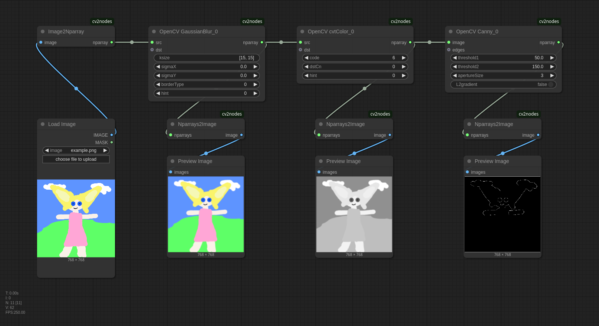
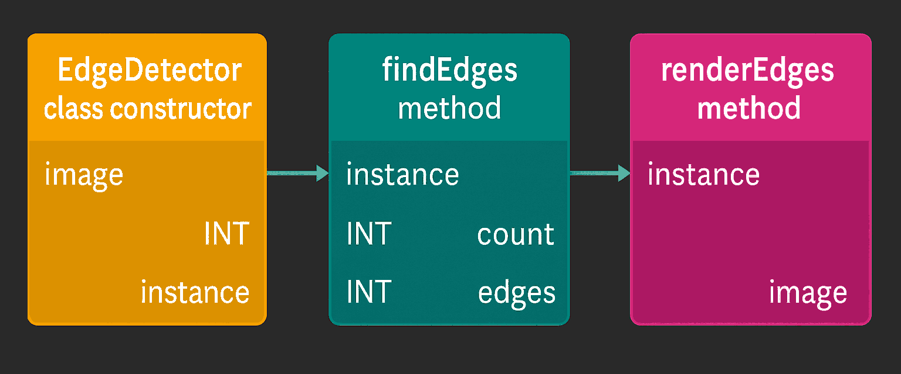

# OpenCV-ComfyUI

Custom nodes for ComfyUI that implement all top-level standalone functions of OpenCV Python, auto-generated from their type definitions.

## Quickstart



1. Install OpenCV:
   ```sh
   pip install opencv-python-contrib
   ```
2. Convert between Comfy image and OpenCV nparray using:
   - `Image2Nparray`
   - `Nparrays2Image`
3. Avoid the optional out-parameters (usually called `dst`).
4. Convert color channels with `cvtColor`. Use:
   - `6` for `BGR2GRAY`
   - `8` for `GRAY2BGR`
5. Use literal strings for composite parameters (e.g., `[3, 3]` for `ksize`).

These nodes are auto-generated from source, so they may be ugly and complex. **Here be dragons!**

## Documentation

For function references, see the official [OpenCV documentation](https://docs.opencv.org/4.11.0/index.html), start with [Image processing filters](https://docs.opencv.org/4.11.0/d4/d86/group__imgproc__filter.html).

Note that most functions in OpenCV use out-parameters which mutate the provided image while also returning it as a return parameter. This pattern doesn't really fit the ComfyUI paradigm and you should generally avoid them. *(I have no automatic way to determine which of them are in or out-parameters yet, sorry)*.

### Installation

You probably already have OpenCV already installed via some other custom node, otherwise install with:

```sh
pip install opencv-python-contrib
```

If you get:
```sh
Cannot import name 'guidedFilter' from 'cv2.ximgproc'
```

you likely have conflicting packages. It's a known source of problems, see [solution](https://github.com/chflame163/ComfyUI_LayerStyle/issues/5).

### Image Representation

| Feature          | ComfyUI `IMAGE`                         | OpenCV images                         |
|------------------|-----------------------------------------|---------------------------------------|
| **Type**         | torch tensor                            | numpy ndarray                         |
| **Shape**        | `(batch, height, width, channels)`      | `(height, width, channels)`           |
| **Color Format** | Always RGB, never RGBA                  | Mostly BGR or grayscale               |
| **Value Range**  | 0.0..1.0                                | 0..255                                |
| **Data Type**    | `np.float32`                            | `np.uint8`                            |

You have to use `cvtColor` to convert between them. Common enums for color conversion:

```python
BGR2BGRA  =  0
RGB2RGBA  =  0
BGRA2BGR  =  1
RGBA2RGB  =  1
BGR2RGBA  =  2
RGB2BGRA  =  2
RGBA2BGR  =  3
BGRA2RGB  =  3
BGR2RGB   =  4
RGB2BGR   =  4
BGRA2RGBA =  5
RGBA2BGRA =  5
BGR2GRAY  =  6
RGB2GRAY  =  7
GRAY2BGR  =  8
GRAY2RGB  =  8
GRAY2BGRA =  9
GRAY2RGBA =  9
BGRA2GRAY = 10
RGBA2GRAY = 11
```

*(we should use `COMBO` for them, I know)*

### Troubleshooting

```
Image2Nparray
Only images with batch_size==1 are supported! batch_size=2
```

Use the `ImageFromBatch length=1` node to select your image and create a image with batch_size=1.

```error: (-215:Assertion failed) img.type() == CV_8UC1 in function```

The function requires a grayscale image. Convert it with `cvtColor code=6` first.

```
Nparrays2Image
'NoneType' object has no attribute 'shape'
```

Not every return type of `nparray` is actually an image. Some are just a 1-dimensional array of floats, but you are using it as an image. Check the OpenCV documentation. Please also note that the OpenCV nodes were auto-generated and not every function is useful within ComfyUI without further processing.

## Development

### Image batches

Comfy `IMAGE` is actually a batch of images, usually with just one, but we have to handle the case with multiple images:
1. We could iterate over the batch and call the OpenCV function for each image, but then we have to collect the output in lists as well. This works as long as the output is just a image, not a tuple. If it is tuple (e.g. `(nparray, int)`) either the user has to select the list index everytime or we treat all inputs as lists too.
2. We always use batch index 0 but this may be surprising behaviour for the user.
3. We just support batch_size=1

### Image versus nparray

The first design choice was how to convert and use Comfy image versus OpenCV nparray.

1. **Always use Comfy `IMAGE` for input and output**
	- fails for functions requiring grayscale images (like `Canny`), because we always convert from RGB to BGR to RGB.
	- we could convert to the required type automatically, but I don't have annotations telling me which function requires which type.
	- type conversions in OpenCV is supposed to be more intentional and there can be multiple correct types.
2. **Provide both `IMAGE` and `nparray` as input and output**
	- the automatic conversion issue above partely applies here and usage would become surprising (`IMAGE` is always RGB, `nparray` is whatever the function outputs)
	- providing both inputs is ambigious *(Maybe Comfy supports multiple types for one parameters, I don't know)*
3. **Provide conversion nodes and only use `nparray`**
   	- I settled with this because it more closly matches the OpenCV style were `cvtColor` conversions are intentional anyway.

### Parsing OpenCV

Function definitions were extracted using `ast.parse()` on `venv/lib/python3.11/site-packages/cv2/__init__.pyi`. This includes **only top-level standalone functions** - not classes or anything hidden in sub-modules.

Attemps to use `inspect.signature(cv2.MedianBlur)` or `inspect.getmembers(cv2.MedianBlur)` failed due to missing type annotations (`ValueError: no signature found for builtin <built-in function MedianBlur>`). OpenCV functions are implemented as C++ extensions, and they do not have Python type annotations (`__annotations__`). Unlike pure Python functions, built-in functions and extension functions do not store signature metadata in a way that Python's reflection tools can access directly.

Most functions are overloaded and they were numbered.

### Types

I then analyzed how many different types and paramter names are used (see `analyze_functions`) to filter out complicated or unsupported functions for now. You can find the infos in [cv2.tsv](docs/cv2.tsv).

* **776 functions in total**.
* Parameters use:
  - simple types: `int, float, str, bool`,
  - composite types (exhaustivly: `Moments, Point, Point2d, Point2f, Rect, Rect2d, RotatedRect, Scalar, Size, TermCriteria`),
  - and images
* Images are represented with the following types:
  - `UMat`
  - `cv2.typing.MatLike`
  - `cv2.typing.MatLike | None` and `UMat | None` usually used for `dst`, but some `dst` are not `None`. used as src only in `reprojectImageTo3D`.
  - `cv2.cuda.GpuMat` but only used in `imshow`
  - `numpy.ndarray` but only used as return type in all variants of `imencode`
* Return types include:
  - Simple types
  - Composite types (`Size, Rect` etc.)
  - many tuples with all types above
  - `_typing.Sequence` which is not supported yet
  - `_typing.Callable` which is not supported yet
  - many class types (like `Tonemap` etc.), which are not supported yet

After filtering out all unsupported types there were **656 functions left**.

For the composite types we could:
* provide extra widgets to construct them (todo),
* split them up in their simple types so `Rect` would become `Rect_0_int_0, Rect_0_int_1, Rect_0_int_2, Rect_0_3` (ugly)
* or use `STRING` and parse them with `ast.literal_eval()`. This is what I used.

### Out parameters

OpenCV often modifies input images in-place with call-by-reference out-parameters, but this does not align with ComfyUI's paradigm. Example:

```python
def medianBlur(src: cv2.typing.MatLike, ksize: int, dst: cv2.typing.MatLike | None = ...) -> cv2.typing.MatLike: ...
```

Most of them are defined as `cv2.typing.MatLike | None` or `UMat | None` but that's no always the case. Some are not `None`:

```python
def normalize(src: cv2.typing.MatLike, dst: cv2.typing.MatLike, alpha: float = ..., beta: float = ..., norm_type: int = ..., dtype: int = ..., mask: cv2.typing.MatLike | None = ...) -> cv2.typing.MatLike: ...
```

I considered some alternative approaches:
* We could assume the first image is always the input image but we cannot assume the second parameter is always an out-parameter because some functions use multiple input images.
* We cannot derive the out-parameter from the return type (assuming the out-parameter is always used as a return), because return types are sometimes tuples with multiple images.
* The position of the out-parameter is inconsistent, sometimes followed by another input image.
* We cannot derive the out-parameter from the parameter name alone. There are 167 unique parameters names (skipping the first one) and the naming is inconsistent.
* I don't know of any strictly typed OpenCV definition file which would of course be the best choise. We can of course parse the [original sources](https://github.com/opencv), [headers](https://github.com/opencv/opencv/blob/4.x/modules/imgproc/include/opencv2/imgproc.hpp) or [C++](https://github.com/opencv/opencv/blob/4.x/modules/imgproc/src/median_blur.dispatch.cpp) [sources](https://github.com/opencv/opencv/blob/4.x/modules/imgproc/src/median_blur.simd.hpp) and derive: out-parameters, value ranges, allowed channel types etc. and construct this definition file, but that's another story.

I just included them as optional inputs for now if the type includes `None`.

### Classes

Ignored for now. Classes don't really fit the ComfyUI style but they would be possible if we pass around chained instances for every method call.



## Todo

* Widgets for composite types instead of literals
* More convinveince functions like enums for `cvtColor`, preview for nparray
* Support image batches with batch_size > 1
* Parse doxygen docs and include them as help-strings
* Automatic conversion between channels
* Provide utility nodes for common patterns (like convert Hough lines to image)
* Parse C++ code for value ranges and detect out-parameters
* Better handling of out-parameters (or removal)
* Blacklist functions which don't make sense in ComfyUI
* Categorize nodes and keep the namespace clean
* Generate custom nodes for classes too

I'm happy to take any contributions! :)

